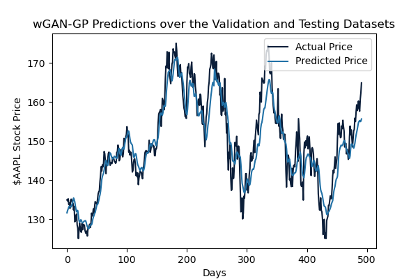

# Conclusion
- Through the implementation of a wGAN-GP model and incorporation of sentiment from retail investors, our model was able to yield promising results that may be difficult to rely on for single day trading, yet extremely useful for longer-termed swing trades. 
- After the conclusion of tuning, we the following hyperparameters were selected for their performance on the validation set:
    - Batch Size = 64
    - Learning Rate = 0.00005
    - Discriminator Training Iterations per Generator Training Iteration = 5
- Ultimately, our model saw the strongest performance with a 3-day-sliding window and the inclusion of sentiment scores from Twitter. This yielded predictions with an the following evaluation metrics:
    - RMSE: 4.401446815516941
    - NRMSE: 0.08795856784549294
    - MAE: 3.4469847679138184
    - MAPE: 0.022908411920070648
- This translates to our model achieving predictions within an error of $3.50 or 2.3% off the actual stock price on average.
- Our final predictions over the validation and testing datasets are demonstrated below:

