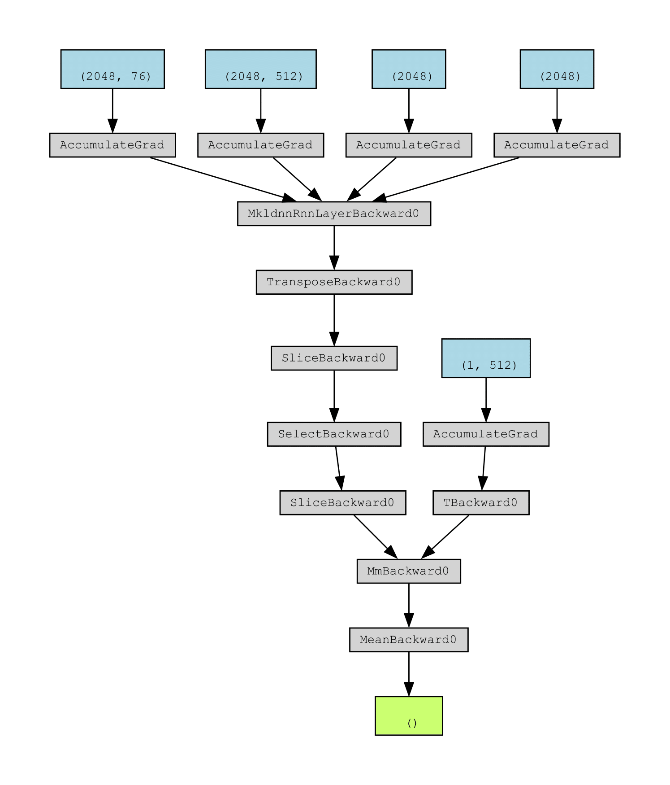

[Home Page](../index.md)

# Approach
## Datasets
- The TDAmeritrade API was resposnible for compiling basic finacial data for $AAPL and a number of comparative assests over the past 10 years including:
    - Open
    - Close
    - High
    - Low
    - Volume
- Comparative Assets
    - To accurately gauge and incorporate industry and macro trends, we have compiled the basic technical indicators of competitive companies and industry indexes. These included:
        - $META
        - $GOOGL
        - $MSFT
        - $AMZN
        - $SP500
- Tweets mentioning "$AAPL" and "AAPL" are scraped from Twitter.
- The dataset includes data from 05/09/2013 to 03/31/2023

## Technical Analysis
### Feature Creation
- Technical indicators are computed from our initial set of basic indicators (Open, Close, High, Low, and Volume). Some of the technical indicators computed are:
    - Stochastic Oscillators
    - Relative Strength Index
    - Simple Moving Averages for Close and Volume
    - Moving Average Convergence/Divergence
- Below demonstrates an example of the use of technical indicators over the last 400 days by showing the correlation of: 
    - SMA 7 (Green)
    - SMA 21 (Red)
    - Upper Band + Lower Band (Cyan)
    - Closing Price of $AAPL (Dark Blue)

### Feature Extraction
(***Note:*** *While attempted, autoencoding did not offer tangible model improvements*)
- An autoencoder is used to produce a set of compressed features from the combination of basic and technical indicators.
- The compressed representation of the full technical indicator set is fed into the prediction model for training and forecasting purposes.

## Fundamental Analysis
- The usage of sentiment analysis of data coming directly from the public (social media websites), rather than from biased news outlets or similar feeds.
- Text content from Twitter are web-scraped and processed via the NLTK library.
- VADER is used upon each media post to compute sentiment scores which are then averaged for any given day.
- A polarity score between -1 and 1 is assigned for average sentiment on a given day.
- Below demonstrates the recorded sentiment values of $AAPL stock over the duration of our dataset.

## Prediction Model
- After feature engineering, our final set of compressed technical indicators is appended with the sentiment scores from the fundamental analysis and fed into a wGAN-GP model for training.
- wGAN-GP Model Description
    - Wasserstein distance is used as a loss function for promotion of training stability.
    - Gradient norm penalty is enforced in the discriminator in hopes of achieving Lipschitz continuity.
    - Generator is an LSTM with input units equal to the final number of features and 512 hidden units, leading into a final linear layer with a single output for the closing price of each day.
    - Discriminator is a 13-Layer CNN composed of 1-D Convolutional, LeakyReLU, and Dense layers.
- Model is tuned with a predefined grid search.

### Generator

### Discriminator

