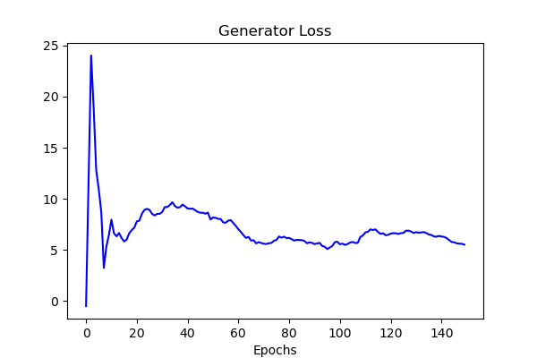

[Home Page](../index.md)

# Best Predictions
The best prediction set returned by the model was with a 3-day sliding window, including sentiment scored from Twitter. The model takes 3 days of basic indicators as input and outputs the predicted closing price of the 4th day.
After tuning, the following hyperparameters were chosen for their performance on the validation set:
> Batch Size = 64  
> Learning Rate = 0.00005  
> Discriminator Training Iterations per Generator Training Iteration = 5  

Additionally, RMSProp, or root-mean-square propagation, was used as the optimization algorithm for the model. Visualizations of the generator and discriminator losses follow.

The discriminator loss appears to converge approximately to 0, while the generator loss appears to converge approximately to 5. These exact values are mostly unimportant. However, it is important to note that, for this dataset, the losses do appear to converge. In prior versions of the model, the losses did not ever converge. This improvement is thought to be due to the implementation of the gradient penalty, in order to enforce the Lipschitz contraint in the discriminator. The usage of the wGAN-GP model's improvements to training stability and convergence is likely to credit for this result. Evaluation of the model's stock price predictions are detailed below.

  
**Evaluation Metrics for Training Set**  
RMSE: 0.7794851587141602  
NRMSE: 0.01557724109617846  
MAE: 0.49299678206443787  
MAPE: 0.0034275564830750227  

The model seems capable of identifying the movement of the stock price and accurately predicting the magnitude of said movement. The inclusion of various technical indicators and sentiment analysis scores improved this greatly from previous iterations of the model.

  
**Averaged Evaluation Metrics for Validation and Test Sets**  
RMSE: 4.401446815516941  
NRMSE: 0.08795856784549294  
MAE: 3.4469847679138184  
MAPE: 0.022908411920070648  

Regarding the validation and testing datasets, the RMSE is a bit higher than that on the training set, indicating a bit of overfitting in the model. Further tuning may be requiring to hone in on a better-generalized model. Despite this, the model still performs well in identifying stock price movements and even comes fairly close to the magnitude of the movement, returning an averaged MAE of 3.447 on these sets.

Taking in the scale of the predicted values, the RMSE appears quite good. Conclusively, the model achieved predictions within an error of about 3.50 or 2.3% off of the actual stock price on average. Although not entirely useful for day trading, this model could prove useful in longer-termed swing trades. 

## wGAN-GP Generator and Discriminator Execution Traces
### Generator

### Discriminator
